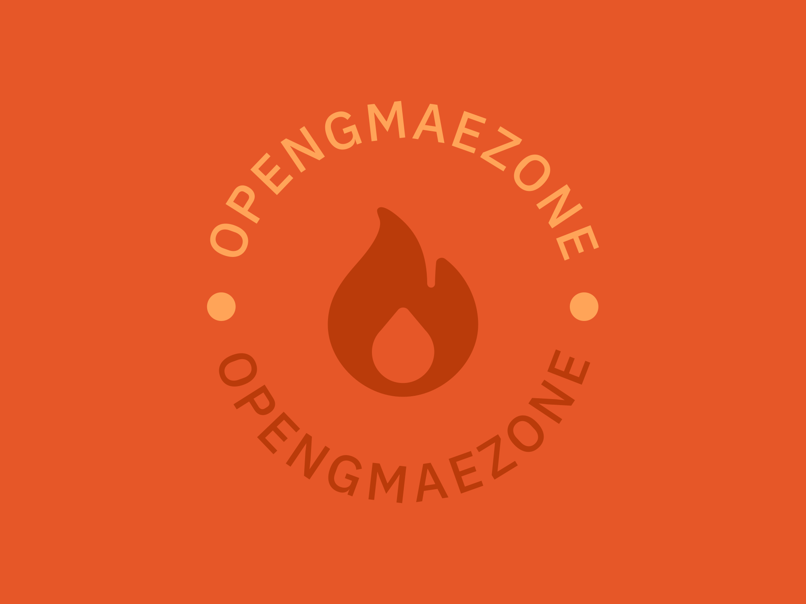

# OpenGameZone



## About

Briefly describe your project here. What is it, what problem does it solve, and why is it important or interesting? You can provide a high-level overview of your project in this section.

## Table of Contents

- [Installation](#installation)
- [Contributing](#contributing)
- [License](#license)

## Installation

Provide instructions on how to install or set up your project. You can include prerequisites, dependencies, and step-by-step installation guides.

```
# Example installation instructions
1. Clone this repository.
2. Install required dependencies using `pip install -r requirements.txt`.
3. Run the application with `python3 main.py`.
```

## Contributing

If you would like to contribute to the project, please follow these guidelines:

1. Fork the repository.
2. Create a new branch for your feature or bug fix.
3. Make your changes and write tests if necessary.
4. Ensure your code passes all tests and linting checks.
5. Submit a pull request with a clear description of your changes.

Please review our [Contributing Guidelines](./CONTRIBUTING.md) for more details.

## License

This project is licensed under the MIT License - see the [LICENSE](./LICENSE) file for details.
